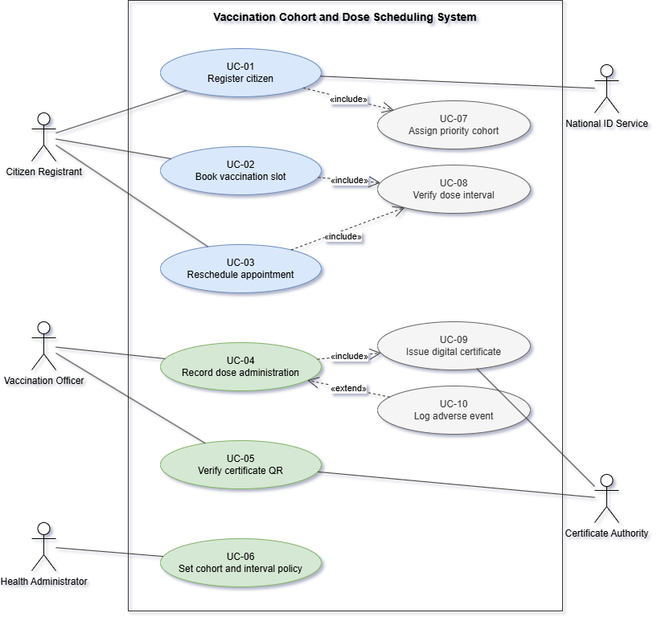

# Vaccination Cohort and Dose Scheduling System

Requirements specification and use case model for a public health platform that runs a district wide vaccination drive.

**Abhigyan Dutta** · SRN PES2UG24CS019 · 5A CSE
Department of Computer Science and Engineering, PES University
Problem Statement 17, Healthcare and Telemedicine

## What the system is meant to do

Citizens sign up on the platform with a government ID, get sorted into priority cohorts based on age, occupation and any declared health condition, and then book a slot at a vaccination centre near them. At the centre, the officer records the dose that was actually given along with the vaccine batch number. Once that record is saved, the platform issues a digitally signed QR certificate that anyone can scan and verify later.

The thing that separates this from an ordinary appointment booking app is the dose interval. A second dose taken too early is medically useless, and the software is the only realistic place where that rule can be held, since a citizen could otherwise just turn up at a different centre and try again. A second constraint is centre capacity, because a session can only handle a fixed number of people no matter how many bookings the system accepts. Most of the requirements in this repository are built around those two rules, plus making the certificate hard to fake.

## Actors

| Actor | Kind | Role |
|---|---|---|
| Citizen Registrant | Primary, human | Registers, books and reschedules slots, downloads the certificate |
| Vaccination Officer | Primary, human | Records doses, scans QR certificates, notes adverse events |
| Health Administrator | Primary, human | Sets cohort rules, the dose gap, and centre capacity |
| National ID Service | Secondary, system | Confirms the government ID given at registration |
| Certificate Authority | Secondary, system | Signs certificate payloads and validates them on scan |

The problem statement named the first two. The administrator was added because somebody has to configure the cohort and interval rules before the system can enforce them, and the two system actors were added because ID checking and certificate signing are clearly done by outside services rather than by this system itself.

## Requirements

Five functional and two non-functional requirements, each with a priority, a measurable acceptance criterion written as a pass and fail pair, and a short rationale. The full table is in the document.

| ID | Summary | Priority |
|---|---|---|
| FR-001 | Block a Dose 2 booking until the minimum gap has passed | High |
| FR-002 | Place every citizen in exactly one priority cohort | High |
| FR-003 | Reject a booking once a session hits its capacity | High |
| FR-004 | Save a dose record with dose number, batch, timestamp and officer ID | High |
| FR-005 | Create a signed QR certificate within 2 minutes of the dose record | Medium |
| NFR-001 | Verify a certificate QR in under 150 ms, online or offline | High |
| NFR-002 | Handle 5000 concurrent bookings at p95 of 2 s with no double booking | Medium |

## Use case model

Ten use cases across three human actors and two system actors.

| ID | Use case | Actor or relationship |
|---|---|---|
| UC-01 | Register citizen | Citizen Registrant, with the National ID Service |
| UC-02 | Book vaccination slot | Citizen Registrant |
| UC-03 | Reschedule appointment | Citizen Registrant |
| UC-04 | Record dose administration | Vaccination Officer |
| UC-05 | Verify certificate QR | Vaccination Officer, with the Certificate Authority |
| UC-06 | Set cohort and interval policy | Health Administrator |
| UC-07 | Assign priority cohort | Included by UC-01 |
| UC-08 | Verify dose interval | Included by UC-02 and UC-03 |
| UC-09 | Issue digital certificate | Included by UC-04 |
| UC-10 | Log adverse event | Extends UC-04 |



### Include and extend

`include` is used where the smaller use case runs every single time. Booking always checks the dose gap, registering always ends in a cohort being assigned, and saving a dose always leads to a certificate. The arrow points from the bigger use case towards the one it needs.

`extend` is used where the behaviour is optional. An adverse event gets logged only if the citizen actually reacts to the injection, so UC-10 extends UC-04 and the arrow points backwards into the base. UC-04 is still complete without it.

## Use case flow

UC-02 Book vaccination slot is specified in full, with preconditions, postconditions, a nine step main success scenario, and two alternate flows. That use case was picked because the dose gap rule, the capacity rule and the include relationship all show up in the same flow, so one specification ends up covering three requirements at once.

The two alternates are the dose gap not being over yet, and the session filling up in the seconds between a citizen picking a slot and confirming it. The second one is the race condition that NFR-002 exists to prevent.

## Repository contents

```
.
├── PES2UG24CS019_SE_Lab1.docx    Full submission: requirements, diagram, use case flow, traceability
├── diagrams/
│   ├── usecase-diagram.png       Exported diagram
│   └── usecase-diagram.drawio.xml  Editable source
├── LICENSE
└── README.md
```

To edit the diagram, open [draw.io](https://app.diagrams.net) and load the `.drawio.xml` file, or paste its contents through Extras then Edit Diagram.

## Traceability

The document also carries a requirement traceability matrix mapping each requirement to the use case that realises it and the flow step or test that checks it. It is not a required deliverable, but it is a fast way to confirm that no requirement is sitting there without a use case behind it.

## License

MIT. See [LICENSE](LICENSE).